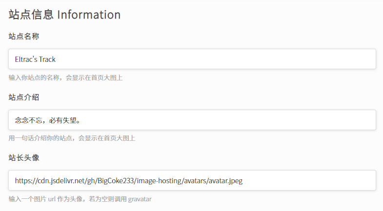
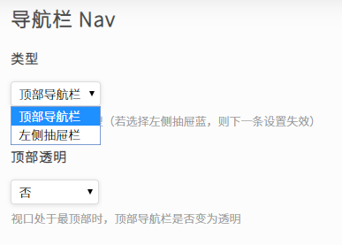
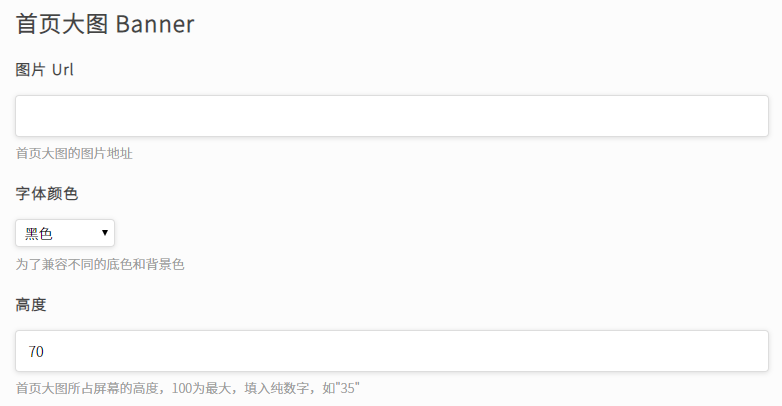
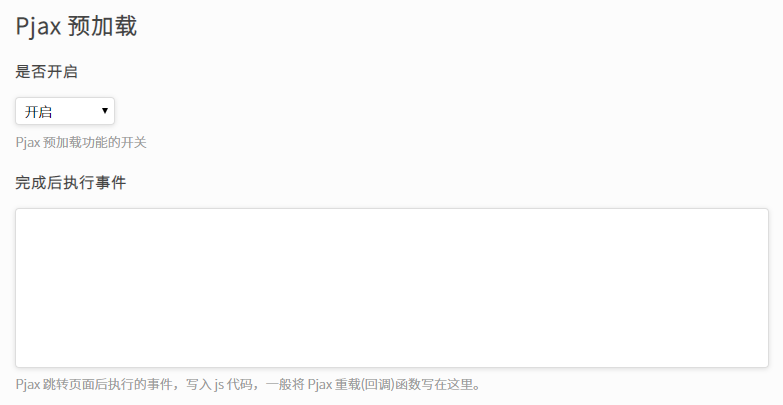
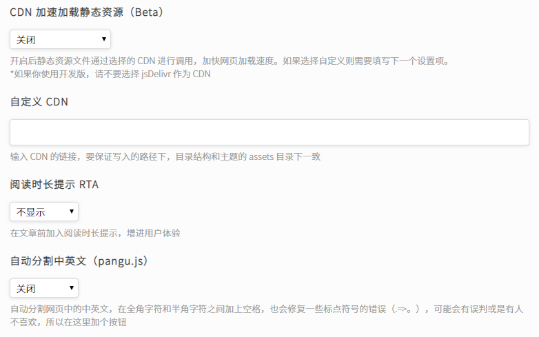
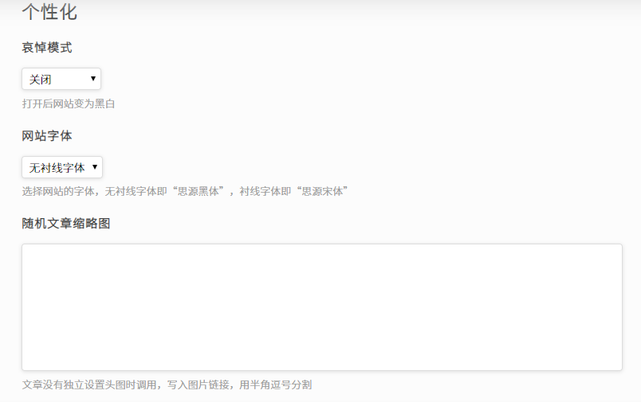
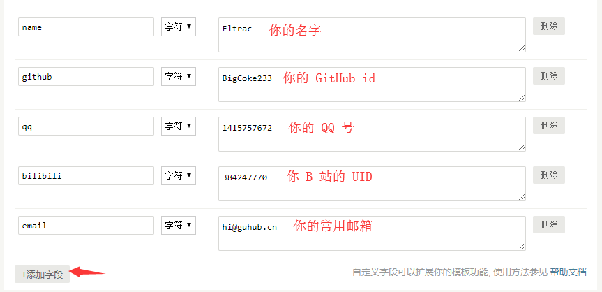

# 使用文档

>  文档基于主题最新版本，不考虑之前的版本差异，请您使用最新版。

感谢您支持 Miracles 主题，这里是主题的使用手册，这能帮助你解决大部分的问题。

**目录**

- [📥 下载与安装](https://github.com/BigCoke233/miracles/blob/master/docs/wiki.md#-%E4%B8%8B%E8%BD%BD%E4%B8%8E%E5%AE%89%E8%A3%85)
    - [主要步骤](https://github.com/BigCoke233/miracles/blob/master/docs/wiki.md#%E4%B8%BB%E8%A6%81%E6%AD%A5%E9%AA%A4)
    - [温馨提示](https://github.com/BigCoke233/miracles/blob/master/docs/wiki.md#%E6%B8%A9%E9%A6%A8%E6%8F%90%E7%A4%BA)
    - [下载主题](https://github.com/BigCoke233/miracles/blob/master/docs/wiki.md#%E4%B8%8B%E8%BD%BD%E4%B8%BB%E9%A2%98)
    - [版权声明](https://github.com/BigCoke233/miracles/blob/master/docs/wiki.md#%E6%B8%A9%E9%A6%A8%E6%8F%90%E7%A4%BA)
- [⚙️ 基础配置](https://github.com/BigCoke233/miracles/blob/master/docs/wiki.md#%EF%B8%8F-%E5%9F%BA%E7%A1%80%E9%85%8D%E7%BD%AE)
    - [站点信息](https://github.com/BigCoke233/miracles/blob/master/docs/wiki.md#%E7%AB%99%E7%82%B9%E4%BF%A1%E6%81%AF)
    - [导航栏](https://github.com/BigCoke233/miracles/blob/master/docs/wiki.md#%E5%AF%BC%E8%88%AA%E6%A0%8F)
    - [首页大图](https://github.com/BigCoke233/miracles/blob/master/docs/wiki.md#%E9%A6%96%E9%A1%B5%E5%A4%A7%E5%9B%BE)
    - [Pjax](https://github.com/BigCoke233/miracles/blob/master/docs/wiki.md#pjax-%E9%A2%84%E5%8A%A0%E8%BD%BD)
    - [优化](https://github.com/BigCoke233/miracles/blob/master/docs/wiki.md#%E4%BC%98%E5%8C%96)
    - [个性化](https://github.com/BigCoke233/miracles/blob/master/docs/wiki.md#%E4%B8%AA%E6%80%A7%E5%8C%96)
    - [开发者设置](https://github.com/BigCoke233/miracles/blob/master/docs/wiki.md#%E5%BC%80%E5%8F%91%E8%80%85%E8%AE%BE%E7%BD%AE)
- [🛒 自定义字段](https://github.com/BigCoke233/miracles/blob/master/docs/wiki.md#-%E8%87%AA%E5%AE%9A%E4%B9%89%E5%AD%97%E6%AE%B5)
    - [文字头图](https://github.com/BigCoke233/miracles/blob/master/docs/wiki.md#%E6%96%87%E7%AB%A0%E5%A4%B4%E5%9B%BE)
    - [文章摘要](https://github.com/BigCoke233/miracles/blob/master/docs/wiki.md#%E6%96%87%E7%AB%A0%E6%91%98%E8%A6%81)
    - [元信息](https://github.com/BigCoke233/miracles/blob/master/docs/wiki.md#%E5%85%83%E4%BF%A1%E6%81%AF)
- [🔖 短代码](https://github.com/BigCoke233/miracles/blob/master/docs/wiki.md#-%E7%9F%AD%E4%BB%A3%E7%A0%81)
    - [友情链接](https://github.com/BigCoke233/miracles/blob/master/docs/wiki.md#%E5%8F%8B%E6%83%85%E9%93%BE%E6%8E%A5)
    - [Tip](https://github.com/BigCoke233/miracles/blob/master/docs/wiki.md#tip)
    - [Ruby](https://github.com/BigCoke233/miracles/blob/master/docs/wiki.md#ruby)
    - [Text Color](https://github.com/BigCoke233/miracles/blob/master/docs/wiki.md#text-color)
    - [Keyboard (kbd)](https://github.com/BigCoke233/miracles/blob/master/docs/wiki.md#keyboard-kbd)
    - [Notice](https://github.com/BigCoke233/miracles/blob/master/docs/wiki.md#notice)
    - [Shadow](https://github.com/BigCoke233/miracles/blob/master/docs/wiki.md#shadow)
    - [Details](https://github.com/BigCoke233/miracles/blob/master/docs/wiki.md#details)
- [📖 页面模板](https://github.com/BigCoke233/miracles/blob/master/docs/wiki.md#-%E9%A1%B5%E9%9D%A2%E6%A8%A1%E6%9D%BF)
    - [归档页面](https://github.com/BigCoke233/miracles/blob/master/docs/wiki.md#%E5%BD%92%E6%A1%A3%E9%A1%B5%E9%9D%A2)
    - [关于页面](https://github.com/BigCoke233/miracles/blob/master/docs/wiki.md#%E5%85%B3%E4%BA%8E%E9%A1%B5%E9%9D%A2)
    - [说说页面](https://github.com/BigCoke233/miracles/blob/master/docs/wiki.md#%E8%AF%B4%E8%AF%B4%E9%A1%B5%E9%9D%A2)
    - [追番页面](https://github.com/BigCoke233/miracles/blob/master/docs/wiki.md#%E8%BF%BD%E7%95%AA%E9%A1%B5%E9%9D%A2)
- [🚀 高级设置](https://github.com/BigCoke233/miracles/blob/master/docs/wiki.md#-%E9%AB%98%E7%BA%A7%E8%AE%BE%E7%BD%AE)

## 📥 下载与安装

Miracles 主题是为 [typecho](https://typecho.org) 设计的，首先你需要安装 typecho。

### 主要步骤

1. 在 GitHub 上 Star [Miracles 主题](https://github.com/BigCoke233/miracles)，这是必须的，因为 Miracles 是基于 SATA 协议的。
2. 主题主要分为**开发版**和**发行版**，请根据情况选择下载使用（之后会详细介绍）
3. 将主题文件放置于 usr/themes 目录下，确保文件夹名字为 **Miracles**
4. 到后台（admin）的外观设置中启用 Miracles 主题
5. 根据需求，在后台 - 外观 - 外观设置中对主题进行配置

### 温馨提示

你的博客最好是安装在站点的根目录下，不然某些功能无法正常使用（如：owo 和 lazyload）

> **发行版**即为 GitHub 仓库里 release 里打包好的版本，比较稳定，推荐使用；但内容一般都经过了压缩打包，删除了大部分注释，不方便魔改或者二次开发，仅对正常使用比较友好。
> **开发版**则为 GitHub 仓库展示的文件内容，是最新的，但不保证稳定性，尽管在 Commit 之前都有经过测试，但可能会有未被发现的 bug。开发版是完整的主题**源**码，没有压缩，对二次开发比较友好。

### 下载主题

以下是 Miracles 最新发行版（1.5.3）的下载链接，推荐使用。

[📦 Miracles.Ver.1.5.4.zip](https://github.com/BigCoke233/miracles/releases/download/1.5.4/Miracles.Ver.1.5.4.zip)

### 版权声明

主题基于 SATA 开源协议进行授权，所以使用前请 Star 本主题，这是最基本的。同时，SATA 协议本身基于 MIT 协议，所以在使用时你需要保留主题原本的版权信息，这些版权信息在页脚和 Console，以及各个静态文件都有，你都需要保留。如果主题引入了别的开源项目没有署名原作者，请告知我及时修正。

如果你需要二次开发并发布新版本的主题，你需要署名原作者并提供原仓库链接，最好尝试联系我，至少让我知道。

## ⚙️ 基础配置

主题的设置面板在 typecho **控制台 - 外观 - 设置外观**中。

安装后打开主题的设置面板，开始对主题进行一些个性的更改。

### 站点信息

这里主要填写你站点的基础信息，与 typecho 的设置不同，这里的设置**仅用于展示**，而不会影响 SEO。



**站点名称**和**站点介绍**都比较好理解，这里对**站点头像**这一项设置做一些说明：**站点头像**内所指定的图片只会输出在左侧抽屉栏和关于页面，评论区和说说页面的头像都是调用您的 gravatar；若这个设置项为空，则会直接调用 gravatar。

**Gravatar - 全球公认的头像**，您可以在[这个网站](http://cn.gravatar.com/)上用您安装 typecho 时填写的邮箱注册账号并上传头像。

<details><summary>加速 gravatar 在国内的速度</summary>

Gravatar 在国内很多地区的访问都十分缓慢，您可以将 gravatar 头像源修改为其他的镜像服务来改善速度，这里推荐 v2ex 的镜像。Typecho 并没有在控制台给出设置项，您需要手动修改代码。

Typecho 根目录下的 config.inc.php，在文件最后添加一条：

```php
/** 定义 Gravatar 头像源 */
define('__TYPECHO_GRAVATAR_PREFIX__', 'https://cdn.v2ex.com/gravatar/');
```

</details>

### 导航栏

Miracles 内置了两种类型的导航栏供您选择，分别是**左侧抽屉栏**和**顶部导航栏**。

**左侧抽屉栏**平时是隐藏的，只有在访问者点击左上角的按钮时才会从左侧抽出，能让访问者更加专注于文章内容；而**顶部导航栏**总是保持在页面顶部，会跟随访问者鼠标滚轮移动，但在访问者向下滑动时会收缩，向上滑动时会再次展开。



您可以根据自己的喜好来选择这两种导航栏，但他们无法同时使用。

**顶部透明**这一项设置只适用于**顶部导航栏**，在使用左侧抽屉栏时启用不会有任何效果。启用后，当访问者的视口置于页面最顶端时，导航栏的背景会变为透明，滚轮向下滑会获得背景色。

1.4.3 版本新增了自定义导航栏功能，可以根据需要自定义导航栏的内容，需要按照 json 格式书写，如下：

```json
[
  {
    "title": "关于",
    "link": "https://yoursite.com/about.html"
  },
  {
    "title": "友人",
    "link": "https://yoursite.com/link.html"
  },
  {
    "title": "归档",
    "link": "https://yoursite.com/archive"
  }
]
```

注意，请不要使用相对路径（即使用完整的, 带协议头和域名的网址），不然 Pjax 可能会失效。

外部链接会自动在新窗口打开；如果设置项留空则读取所有未被隐藏的独立页面。

### 首页大图

**首页大图**位于所有页面的顶部，它通常是一张较大的图片，仅展示。首页大图上方会显示你在之前设置的站点名称和站点介绍，靠左展示。



填入一个**图片 url** 来指定首页大图展示的图片，可以是绝对路径也可以是相对路径。

如果您不了解绝对路径和相对路径，填写图片外链就好了。

**字体颜色**只有黑色和白色可供选择。通常情况下，在有图片的时候使用白色就好；而不填写**图片 url** 时，背景色会是淡灰色（#f1f1f1），这个时候使用黑色。顺带一提，如果你设置了导航栏的**顶部透明**，这个设置项会影响导航栏透明时的颜色。

**高度**的单位是 vh，如果你不理解，可以把这个高度当作百分数，只是没有 % 而已，例如：填写 50 的话，首页大图则会占据一个视口（即浏览器窗口中显示网页的部分）的一半。

### Pjax 预加载

Pjax 预加载可以加快页面的访问速度，并让访问更加流畅，提升用户体验



你只需要在 Pjax 预加载 - **是否开启**中开启，就可以启用 Pjax。

**完成后执行事件**内写的一般是 Pjax 重载函数，主题的 js 都内置了重载函数所以你不用太操心。如果你安装了一些插件，可能会需要进行重载，不过插件的作者应该都会有说明。

一些 js 在切换页面后会出现错误，这时候需要一段 js 在 pjax 完成切换之后将它们重新加载一遍。

如果你使用了 Meting 插件，记得在**完成后执行事件**中写入 loadMeting();

### 优化



开启 **CDN 加速加载静态资源**之后，大部分的 js 和 css 静态资源都会通过你选择 CDN 进行加载，主题内置的有 jsDelivr（国内速度快）和 GitHack（国内速度慢）。如果你使用的是**开发版**，请不要使用 jsDelivr，以免出现问题，但是 GitHack 一般不会有问题，除非你用的不是最新开发版，就是速度慢；如果你使用的是**发行版**，推荐使用 jsDelivr。
如果你选择自定义，则会调用下一条设置内的链接，例如 `[https://cdn.xxxxxx.com/assets/](https://cdn.xxxxxx.com/assets/，这会调用所指向的这个目录下的静态资源，不过需要保证目录结构和主题的`/assets/`)`，这会调用所指向的这个目录下的静态资源，不过需要保证目录结构和主题的 `./assets/` 下的结构相同。

**阅读时长提示**会根据文章的字数估计阅读需要的大致时间，并显示在每一篇文章之前。

**自动分割中英文**默认是开启的，基于 `pangu.js`，会分割网页中的半角字符和全角字符，会把中文之间的 `.` 替换为 `。` 等等操作，如果不喜欢可以在这里关掉。

### 个性化

**个性化**设置能让你的博客变得更符合你的品味。



**哀悼模式**是在京阿尼失火的事故后被加入的，这会让整个网站变成黑白配色。

**网站字体**是通过 Google Font 调用的，无衬线字体即为思源黑体，衬线字体即为思源宋体。

**随机文章缩略图**通常是使用的主题 images/postbg 目录下的 1-20.jpg 图片，如果你不喜欢或是觉得加载较慢，你可以通过图片外链自定义，通常需要这样写：

```php
https://image.com/1.png,
https://image.com/2.png,
https://image.com/3.png,
https://image.com/4.png,
https://image.com/5.png
```


**图片懒加载动画**是在图片加载完成之前显示的图片，目前有 4 种可供选择的懒加载动画，这里不提供预览，如果不喜欢列出的图片，可以选择“自定义”，但需要在 `./images/loading/` 目录下放入一个名为 `custom.gif` 的 GIF 图片。

剩下的两个不做过多的解释，设置项下面的文字写得很明白。

### 开发者设置

这里的设置不是必须的，你可以根据需要写入 js 和 css，或是在 head 和 footer 自定义你想要的内容。例如 Google 统计代码、在网页中嵌入在线客服等等。

## 🛒 自定义字段

在编辑文章的时候你可能会用到自定义字段，下面介绍主题自带的字段，你只需要根据提示进行设置就可以了。用于关于页面和追番页面的自定义字段不会在这里提及，请查看**页面模板。**

### 文章头图

文章头图会显示在文章列表和文章内页里，作为文章的缩略图和封面。你需要填写一个图片外链，可以是上传自其他图床生成的外链，也可以是本地服务器上的文件。

为了保障头图的最佳显示效果，最好使用 1000x600 的图片；更加详细的话，最好是 47:28 大小的图片


### 文章摘要

用于自定义文章摘要，摘要只显示在首页的文章列表里，显示在文章卡片内的文章标题下，让用户提前阅读文章的前一段。如果这个设置项为空，则会自动读取文章前 130 字；如果填写内容，则会用你自定义的内容来代替这 130 字。

为了保证显示效果，自定义的摘要不要太长也不要太短，可以用 `<br>` 来使摘要内容在页面中显示更加平衡。


### 元信息

**元信息（Meta）**是显示在文章头图上以及首页文章卡片内的文章概要信息，它通常有文章分类 / 发布日期 / 评论数 / 被浏览数等信息，会被展示在不太起眼的地方，但是也是比较有用的东西。

如果你不太喜欢他们，可以用这个设置项替换**显示在文章头图上的元信息**。


不用担心，替换元信息后，主题仍会统计页面的被浏览数，切换为默认元信息后这些数据会被显示

## 🔖 短代码

你只需要在文章/页面编辑器内按照相应的语法书写就好了。

这些短代码能在你编辑页面或是攥写文章的时候帮助你。

### 友情链接

首先，所有的友情链接都需要放到 `Link Box` 里，通过下面的语法构造一个 `Link Box`。

```markdown
[links]
······
[/links]
```

所有的友链项目都需要按照以下的语法书写。

```markdown
<!-- 常规写法 -->
[名字]{链接}(头像链接)+(简介)

<!-- 如果是 1.3.2 以前的版本，则 -->
[名字]{链接}(头像链接)
```

然后放进一个 `Link Box` 里。

```markdown
[links]
[名字]{链接}(头像链接)+(简介)
[名字]{链接}(头像链接)+(简介)
[名字]{链接}(头像链接)+(简介)
[/links]
```

注意，短代码里所有的链接都需要**转义**！

```markdown
<!-- 在特殊字符 / 之前加上 \ 进行转义 -->
https:\/\/guhub.cn\/links.html
<!-- Example -->
[名字]{https:\/\/guhub.cn\/}(https:\/\/guhub.cn\/avatar.jpg)+(我是简介。)
```

如果你觉得转义比较麻烦，可以用 `!!!` 包裹短代码。

```markdown
!!!
[links]
[名字]{https://guhub.cn/}(https://guhub.cn/avatar.jpg)+(我是简介。)
[名字]{https://guhub.cn/}(https://guhub.cn/avatar.jpg)+(我是简介。)
[/links]
!!!
```

---

在 1.5.0 版本以后，友情链接支持通过 json 传递数据，只不过你需要一个现有的 `.json` 文件，而不能直接书写 json，语法如下。当然，这只是传递友链数据的**一种方式**。

```markdown
[links data="https://data.com/links.json"]
```

借助这个，你可以把你的友链数据存在 GitHub 然后通过 jsDelivr 调用，这样可以防止友链数据丢失，完全不用备份，在国内的速度也很不错。通常你要在 json 文件内写入 json 数组，如果你不理解，在主题 `./assets/` 目录下有一个名为 `linkData.sample.json` 的文件，是友链数据书写的示例。

```json
[
  {
    "name": "Eltrac", 
	"link": "https://guhub.cn/", 
	"avatar": "https://cdn.jsdelivr.net/gh/BigCoke233/image-hosting/avatars/avatar.jpeg", 
	"des": "暗夜行路，终遇奇迹。"
  },
  {
    "name": "Example", 
	"link": "https://example.io/", 
	"avatar": "https://cdn.jsdelivr.net/gh/BigCoke233/image-hosting/avatars/avatar.jpeg", 
	"des": "这是一个示例。"
  },
  {
    "name": "Example", 
	"link": "https://example.io/", 
	"avatar": "https://cdn.jsdelivr.net/gh/BigCoke233/image-hosting/avatars/avatar.jpeg", 
	"des": "这是一个示例。"
  },
  {
    "name": "Example", 
	"link": "https://example.io/", 
	"avatar": "https://cdn.jsdelivr.net/gh/BigCoke233/image-hosting/avatars/avatar.jpeg", 
	"des": "这是一个示例。"
  },
  {
    "name": "Example", 
	"link": "https://example.io/", 
	"avatar": "https://cdn.jsdelivr.net/gh/BigCoke233/image-hosting/avatars/avatar.jpeg", 
	"des": "这是一个示例。"
  }
]
```

### Tip

Tip 用作明显的提示，可以按照以下的语法书写。

```markdown
[tip]最普通的 Tip，颜色为 灰色（在 1.3.2 以前跟随 --theme-color）[/tip]
[tip type="red"]颜色为 红色 的 Tip[/tip]
[tip type="blue"]颜色为 蓝色 的 Tip[/tip]
[tip type="yellow"]颜色为 黄色 的 Tip[/tip]
[tip type="green"]颜色为 绿色 的 Tip[/tip]
```

你也可以尝试自定义 Tip 的颜色，在 Miracles 设置面板 - 开发者设置 - 自定义 CSS 中这样书写。

```css
.tip.TYPE {
    border-left-color: 指定边框颜色;
}
.tip.TYPE .tip-icon {
    color: 指定 i 图标颜色;
}

/* example */
.tip.black {
    border-left-color: #000;
.tip.black .tip-icon {
    color: #000;
}
```

然后就可以这样使用自定义的 tip。

```markdown
[tip type="TYPE"]内容[/tip]
<-- example -->
[tip type="black"]内容[/tip]
```

这样可以把多个 Tip 连接起来，使他们排列更紧凑。

```markdown
[tip-group]
[tip]最普通的 Tip[/tip]
[tip type="red"]颜色为 红色 的 Tip[/tip]
[tip type="blue"]颜色为 蓝色 的 Tip[/tip]
[tip type="yellow"]颜色为 黄色 的 Tip[/tip]
[tip type="green"]颜色为 绿色 的 Tip[/tip]
[/tip-group]
```

### Ruby

使用以下的语法，可以为文本注音。

```
蚊子的幼虫叫做{{孑孓:jie jue}}。
```

### Text Color

使用以下的语法，自定义一段文本的前景色和背景色。

```
&{我是一段黑色字体黄色背景的文字|#000|yellow}
&{你看不到我，你看不到我看不到我|#fff|transparent}
&{我是一段天依色背景的大红色文字|rgb(255,0,0)|#66ccff}
```

### Keyboard (kbd)

Markdown 原生语法并不支持 `<kbd>` ，Miracles 主题在 1.5.0 以后对 Markdown 语法进行了拓展，你可以通过以下语法来书写 `<kbd>` 标签，用来表示键盘上的按键。

```markdown
<!--现在可用的语法-->
~Ctrl~
<!--在开发版以及以后的版本中，将会使用以下语法-->
[[Ctrl]]
```

### Notice

用以下语法构建一个 notice 块，让文字更加醒目

```markdown
[notice]Make texts stand out.[/notice]
```

### Shadow

在 shadow 容器里的图片会带上阴影

```markdown
[shadow][/shadow]
```

### Details

> 目前 Details 仅支持`v20200530A`（开发版）及以后的版本，未在正式版中加入

用以下的语法快速写入 details 标签，创造一个下拉框，主题已借助 js 垫片优化了 details 标签的兼容性

```markdown
[details sum="标题"]内容[/details]
```

## 📖 页面模板

在您创建页面的时候，你可以在右侧选择一个模板。


接下来我会介绍 Miracles 每一个可使用的模板。

### 归档页面

**归档页面**会在前台列出你博客所有的文章以及标签，它们比起在首页文章列表显示的要更加紧凑，没有分页。无需设置，只需要选择归档页面，并发布，就可以了。

### 关于页面

选择**关于页面**模板会在页面内容的顶部加上你的头像，你也可以通过一些其他的设置来添加更多有用的东西。

在编辑器底部添加自定义字段，按一下的方式命名并填写，就可以在头像后添加你的名字和各种社交链接。



你并不需要输入所有的字段，添加了哪些字段就会显示哪些。

### 说说页面

选择说说页面后直接发布，登陆后可以在前台输入内容发布，这样输入的内容就会显示在说说页面里。这是通过 typecho 自带的评论系统进行储存的，所以如果你想要删除一条说说，直接在后台管理评论即可。

### 追番页面

1. 创建一个 `独立页面`
2. 选择 `自定义模板` 为 `追番界面`
3. 添加 `自定义字段`
    - `sessdata` 设置为 bilibili cookie中的sessdata字段
    - `uid` 设置为您的bilibili uid
4. 发布页面就可以了!

**获取 SessData**

如果是 Chrome：

1. 打开**[bilibili.com](https://bilibili.com/)**
2. 按下 `F12` 进入`开发者工具`
3. 选择 `Application` 选项卡
4. 在左边列表选择 Storage - Cookies - `https://www.bilibili.com`
5. 在右边找到 `SESSDATA`, 复制里面的Value

    

如果是 FireFox：

Firefox大同小异,只是在第三步时选择 `存储` 选项卡

如果是 Microsoft Edge：

目前 Edge 已经更换为 Chromium 内核,和Chrome操作一样

**获取 UID**

在登录状态下打开 **[https://space.bilibili.com](https://space.bilibili.com/)** 页面会跳转到 **[https://space.bilibili.com/你的uid](https://space.bilibili.com/%E4%BD%A0%E7%9A%84uid)** 直接取出即可

***若发现追番页面的追番进度显示不正常，请尝试更新你的 SESSDATA**

## 🚀 高级设置

> 注意，以下所有的内容都未在正式版加入

未来会加入高级设置的选项，但通常来说，高级设置不能直接通过后台设置，而是修改本地的某个 php 文件中的数组，这样做是为了减少后台的设置项数量，同时也加强 Miracles 主题的自定义性。并且，写在本地而并非数据库中的设置项调用起来会更加方便。

### 语言包

Miracles 正准备加入「语言包」功能，并已经在`/libs/lang/`目录下内置了简体中文、繁体中文、英语和~~萌语~~四种语言的数据，但目前尚未完善，也没有写入实际的功能。

### faviconDark

在系统夜间模式下，一些浏览器的外观也会变成深色，这个时候一些深色的 favicon 就会显得很违和，你可以在你的网站根目录下创建一个名为 `faviconDark.ico` 的文件来作为深色模式下显示的 favicon

## 👁‍🗨 遇到问题

如果遇到本文档无法解决的问题，不要着急，进行以下操作：

1. 清除浏览器缓存和 CDN 缓存，然后再次重复之前的操作
2. 检查你是否修改过源代码，如果有，还原代码试试
3. 确认主题版本是否为最新版
4. 看看在 GitHub 仓库的 issues 是否有类似的提问，作者是否回复
5. 通过 QQ 或者 Email 联系作者，或者提出 issue
